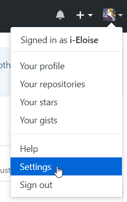
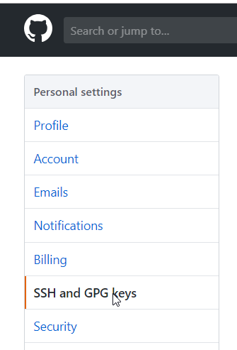
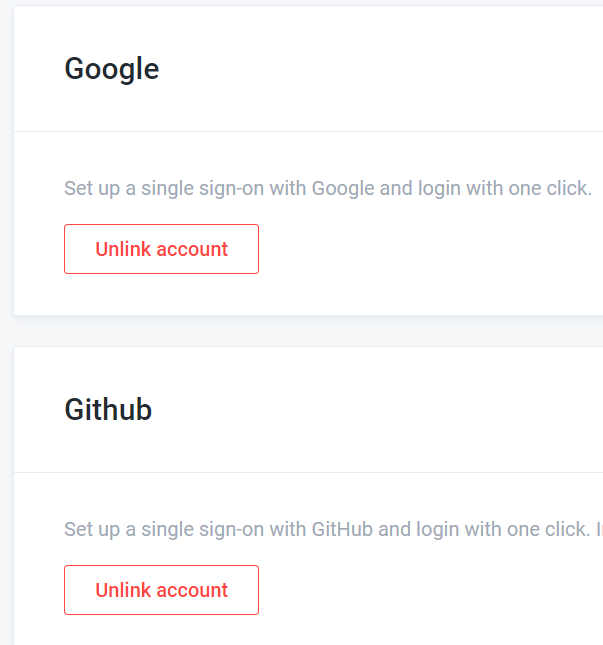
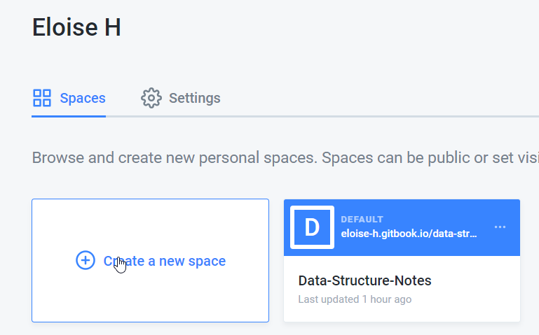
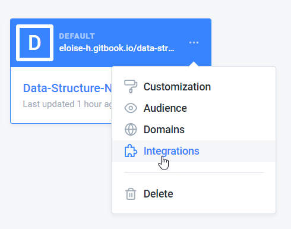
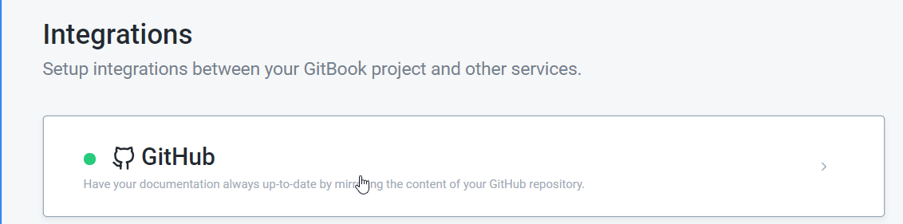

# Chap 1:  Github & Gitbook

## git

参考：[https://www.liaoxuefeng.com/wiki/0013739516305929606dd18361248578c67b8067c8c017b000](https://www.liaoxuefeng.com/wiki/0013739516305929606dd18361248578c67b8067c8c017b000)

1. download:

   [https://git-scm.com/downloads](https://git-scm.com/downloads)

2. GUI

   github desktop

   or

   source tree

3. 找一个文件夹作为git的文件夹

   使用git init来初始化

   常用命令：

   ```text
   git add .
   git add test.txt
   git commit -m "this is a test"
   git status
   git diff test.txt
   git log
   git reglog
   git remote -v
   删除：
   git rm test.txt
   git commit -m "remove test.txt"
   如果要把远程的也删除就要执行：
   git push github master
   ```

4. 把本地文件夹和github的repository关联

   ```text
   查看状态
   git remote -v
   删除连接
   git remote rm origin  
   添加连接
   git remote add github git@github.com:githubname/gitrepo.git
   把commit的文件push到master branch
   git push -u github master 
   git push github master
   ```

## github

1. create a repository in github web
2. link the repository on web with local repository

   ​ 1）生成ssh key

   ```text
   ssh-keygen -t rsa -C "email@address.com"
   ```

   生成2个文件在C盘user目录下用户的.ssh文件夹内

   带.pub的是公钥，用来放到github网页ssh key里面\(见下一步\)

   ​ 2）添加ssh key

   

   

我遇到的问题：一个ssh key 只能和一个账户相关联，关联多个就会报错

## gitbook

1. 安装Node.js

   [https://nodejs.org/en/download/](https://nodejs.org/en/download/)

2. 安装gitbook

   打开Node.js command prompt，输入

   ```text
   npm install gitbook-cli -g
   ```

3. 初始化笔记本

   Node.js command prompt进入笔记本文件夹

   windows

   e: 表示进入E盘

   然后使用cd进一步确定文件夹的位置

   在笔记本文件夹下面输入

   ```text
   gitbook init
   ```

   会出现

   SUMMARY.md

   README.MD

   等多个文件

   重点关注SUMMARY.MD文件，因为它确定了书本的目录结构

   参考写法：

   ```text
   # Summary

   * [前言](README.md)
   * [第一章](Chapter1/README.md)
       * [第1节：河东](Chapter1/广东.md)
       * [第2节：河西](Chapter1/广西.md)
       * [chapter 1.1](Chapter1/chapter 1.1/README.md)
           * [嵌入](Chapter1/chapter 1.1/嵌入.md)
   * [第二章](Chapter2/README.md)
   ```

4. 再次执行gitbook init来快速创建文件夹和文件

   注意事项：

   * SUMMARY.MD里面写出来的才是书本的目录，里面链接了文档，没有被这个文件链接的文档，在local Web书本里面是看不见的
   * 如果SUMMARY.MD某一行没有了那个括号，也就是说这个字在local Web书本里面不能超链接，点击没有反应不会跳转

5. 可以创建本地server快速查看书本（创建local web）

   ```text
   gitbook serve
   ```

## gitbook io

参考：[https://blog.csdn.net/lu\_embedded/article/details/81100704](https://blog.csdn.net/lu_embedded/article/details/81100704)

1. 创建账号

   然后，在设置里面，账号可以link谷歌账号和github账号

   

2. 创建Space



1. 把书本和github repository连接在一起

   



连接好之后，github上的文档就可以在这里看到了

## 使用指南简略版

1. 本地安装git，gitbook
2. 本地初始化文件夹
3. gitbook github 网站上创建相应的Project
4. 把本地文件夹和github相关联
5. 把githubh和gitbook相关联

在本地gitbook进行编辑，push到github去，gitbook web就可以直接看到了

