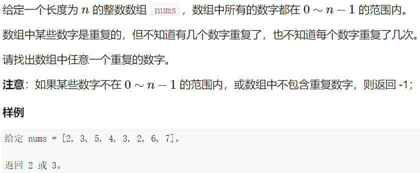
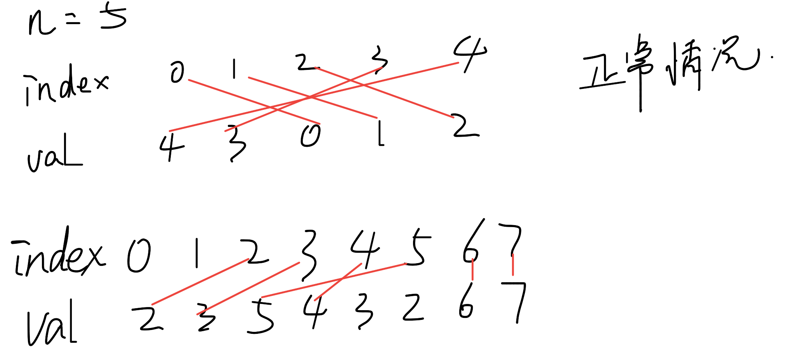

# Q1.找出数组中重复的数字




分析：

可能 没有/有一个/有多个数字 重复

已知长度为n的整数数组里，所有数字都在0~n-1范围内，如果没有重复的话，index和val能一个一个连线对应



非正常情况就不能一一对应

逐个交换让index和val对应上

```
class Solution {
public:
    int duplicateInArray(vector<int>& nums) {
        int n = nums.size();
        for(auto x: nums) if(x < 0 || n - 1 < x) return -1;
        int i = 0;
        while(i < n)
        {
            while(nums[i] != i && nums[nums[i]] != nums[i]) swap(nums[i], nums[nums[i]]);
            if(nums[i] != i) return nums[i];
            i++;
        }
        if(i == n)  return -1;
    }
};
```

