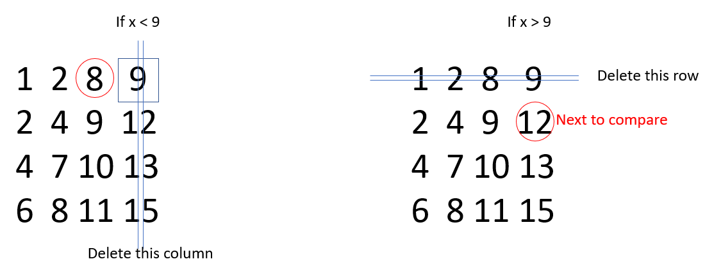

# Q3. 二维数组中的查找




```c++
class Solution {
public:
    bool searchArray(vector<vector<int>> array, int target) {
        int n = array.size();
        if(!n) return false;
        int m = array[0].size();
        int i = 0, j = m - 1;
        while(i < n && j >= 0)
        {
            if(target == array[i][j]) return true;
            else if(target < array[i][j]) j--;
            else if(target > array[i][j]) i++;
        }
        return false;
    }
};
```

