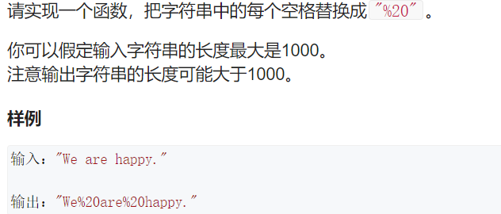
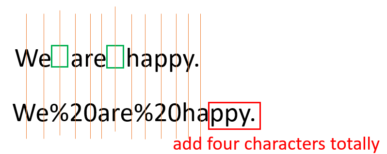

# Q4. 替换空格





We can first scan the string then add space for characters. Then fill the space.

```c++
class Solution {
public:
    string replaceSpaces(string &str) {
        int count = 0;
        for(auto x: str) 
            if(x == ' ') count++;
        int i = str.size() - 1;
        str.resize(str.size() + 2 * count);
        int j = str.size() - 1;
        while(i >= 0)
        {
            if(str[i] != ' ') str[j--] = str[i--];
            else
            {
                str[j--] = '0';
                str[j--] = '2';
                str[j--] = '%';
                i--;
            }
        }
        return str;    
    }
};
```


