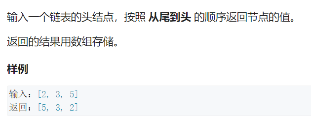
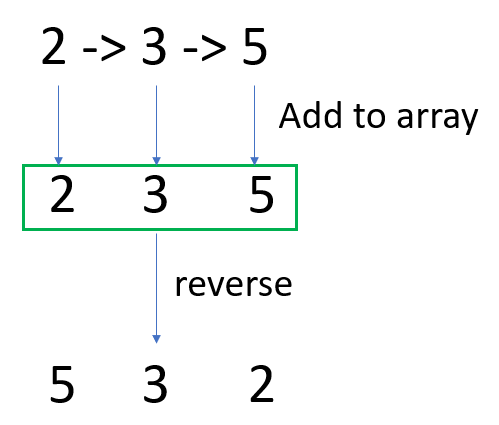

# Q5. 从尾到头打印链表





```c++
/**
 * Definition for singly-linked list.
 * struct ListNode {
 *     int val;
 *     ListNode *next;
 *     ListNode(int x) : val(x), next(NULL) {}
 * };
 */
class Solution {
public:
    vector<int> printListReversingly(ListNode* head) {
        vector<int> ans;
        if(!head) return ans;
        while(head)
        {
            ans.push_back(head->val);
            head = head->next;
        }
        reverse(ans.begin(), ans.end());
        return ans;
    }
};
```

