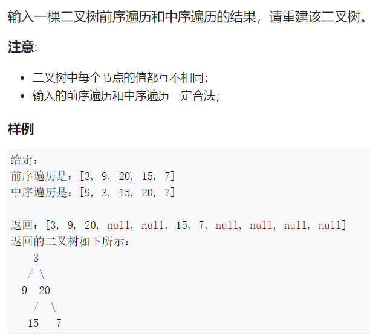
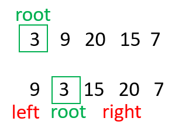

# Q6. 重建二叉树





```c++
/**
 * Definition for a binary tree node.
 * struct TreeNode {
 *     int val;
 *     TreeNode *left;
 *     TreeNode *right;
 *     TreeNode(int x) : val(x), left(NULL), right(NULL) {}
 * };
 */
class Solution {
public:
    map<int, int> pos;
    vector<int> preorder, inorder;
    TreeNode* buildTree(vector<int>& _preorder, vector<int>& _inorder) {
        preorder = _preorder, inorder = _inorder;
        int n = preorder.size();
        if(!n) return nullptr;
        for(int i = 0; i < n; i++) pos[inorder[i]] = i;
        return dfs(0, n - 1, 0, n - 1);
    }
    
    TreeNode* dfs(int pl, int pr, int il, int ir)
    {
        if(pl > pr) return nullptr;
        TreeNode* root = new TreeNode(-1);
        root->val = preorder[pl];
        int p = pos[root->val];
        root->left = dfs(pl + 1,pl + 1 + (p - 1 - il + 1) - 1 , il, p - 1);//pl + p -il
        root->right = dfs(pl + p - il + 1, pr, p + 1, ir);
        return root;
    }
};
```

