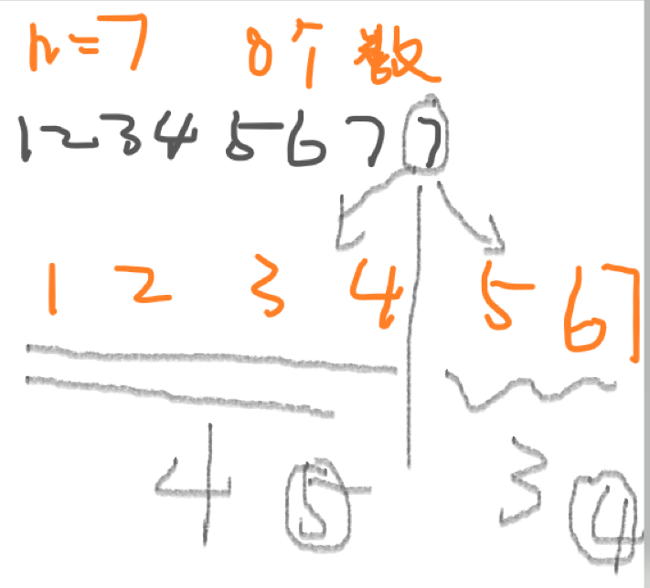

# Q71.数组中只出现一次的两个数字



1-4只有4个数字正常， 那么5-7就有超过3个数字，

如果1-4有3个数字，5-7就有4个数字

利用二分法求出来到底哪个数字有多个数字

```
class Solution {
public:
    int duplicateInArray(vector<int>& nums) {
        int n = nums.size() - 1;
        int l = 1, r = n;
        while(l < r){
            int mid = l + r >> 1;
            int tmp = 0;
            for(auto x: nums)
                if(l <= x && x <= mid) tmp++;
            if(tmp > mid - l + 1) r = mid;
            else l = mid + 1;
        }
        return l;
    }
    
};
```

