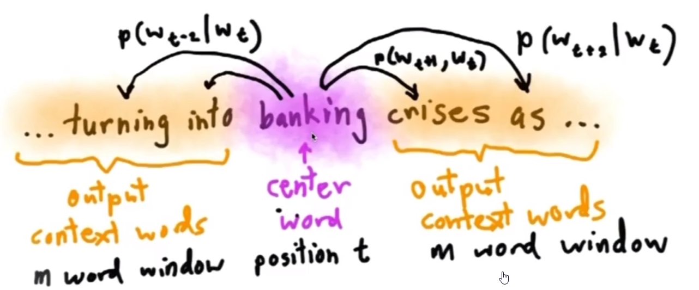
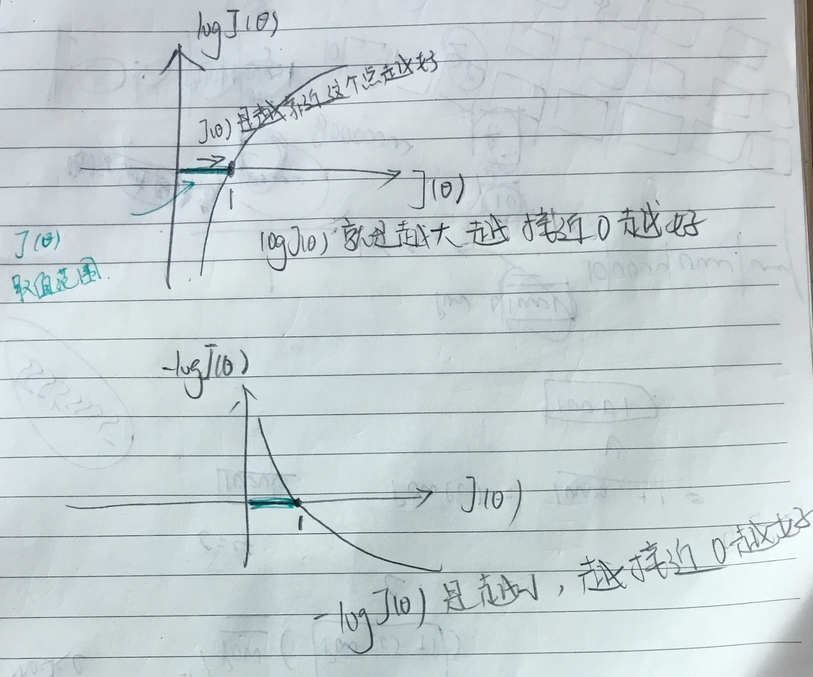
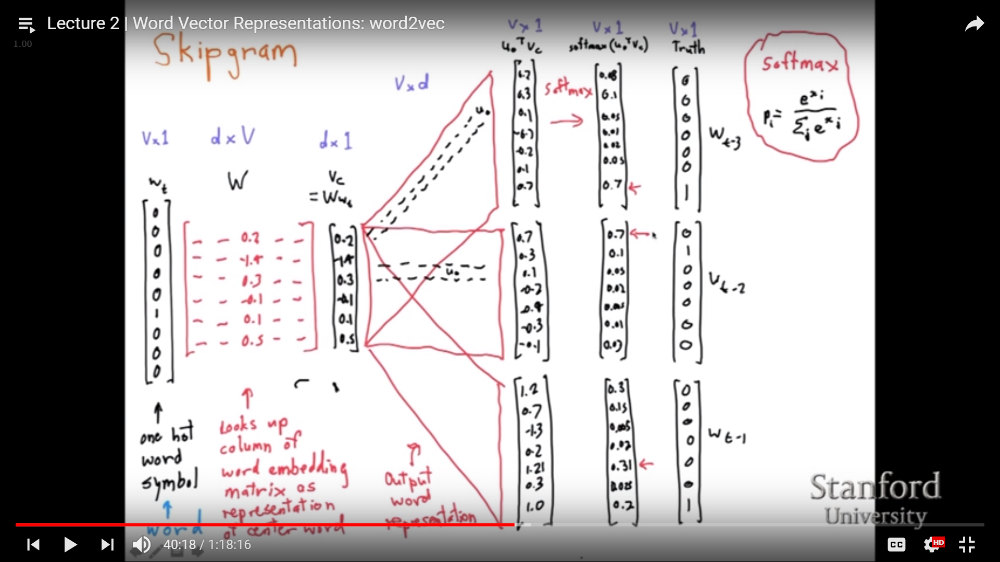
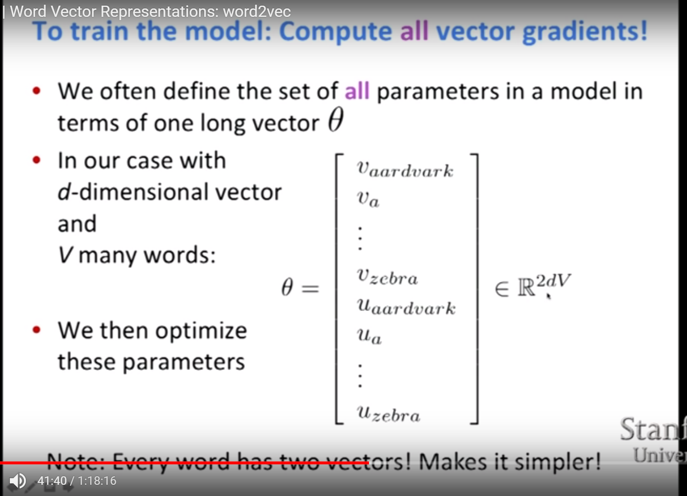
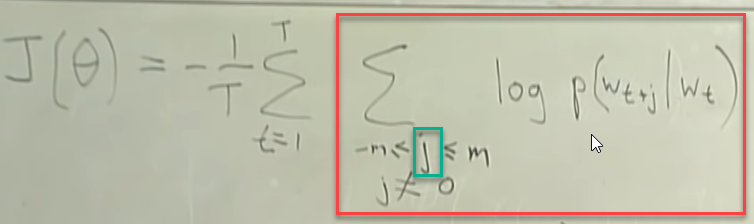
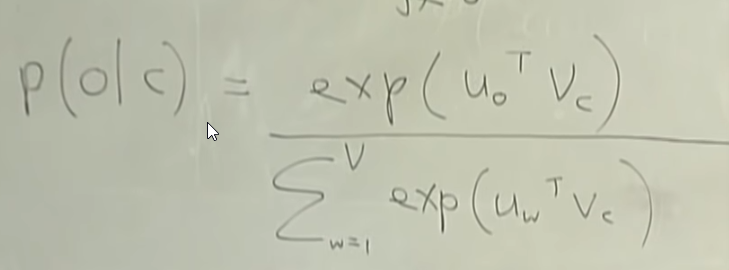
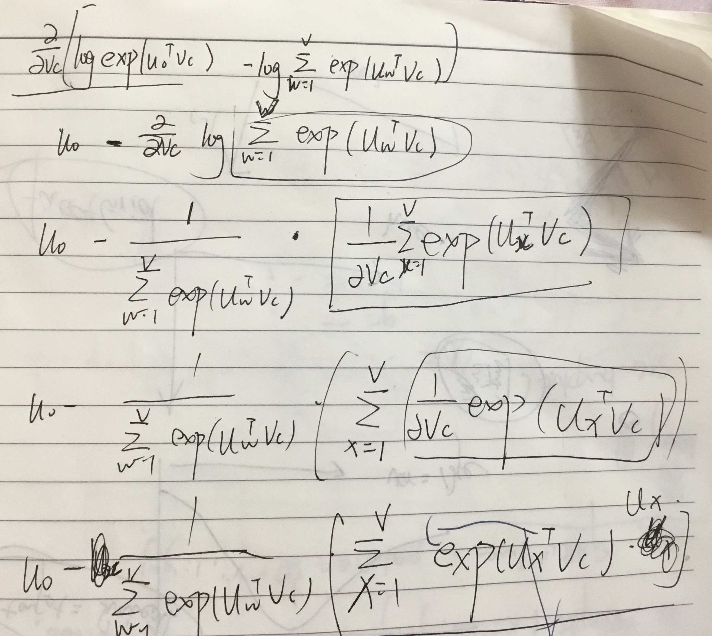

# Lecture 2:  Word2Vec

## definition

good这一个单词有很多意思，可以是expert，delicious，怎么选区恰当的意思成为了困难

## From symbolic to distributed representation

从表示的符号到离散表示

例子 [Dell notebook battery size] 应该和[Dell laptop battery capacity]是相近的，

但是如果notebook使用[0 0 0 0 0 0 0 0 0 0 1 0 0 0 0]表示

laptop用[0 0 0 0 0 0 0 1 0 0 0 0 0 0 0]表示，就很难找出这两个词的相似性

Our query and document vectors are orthogonal

There is no natural notation of similarity in a set of one-hot vectors 

## Word meaning is defined in terms of vectors

So what we want to do is say for each word we're going to come up for a vector and that dense vector is gonna be chosen so that it'll be good at predicting other words that appear in the context of this word.

$p(context|w_t)=...$    

loss function: 

$J = 1 - p(w_{-t}|w_t)$                -t: everything except t 

our goal will be to change the representations of words so as to minimize our loss

### Two algorithms:
1. Skip-grams: Predict context words given target (position independent)

$p(context|w_t)=...$  这个context是指全部，不是说一个单词是一个context，也不是左边是一个context右边一个context

$J(\theta) = \prod\limits_{t=1}^{T}\prod\limits_{-m\leqslant j \leqslant m,j\neq0}P(w_{t+j}|w_t;\theta)$   越大越好

in practice, we turn things to log probabilities

Negative log likelihood:

$J( \theta) = -\frac{1}{T}\sum\limits_{t=1}^{T}\sum\limits_{-m\leqslant j \leqslant m,j\neq 0}logP(w_{t+j}|w_t;\theta)$

$\frac{1}{T}$:   take the average over each positions so we've got 1 one T here

​	making it per word as sort of a kind of noralization

-:     minimize things

Terminology:

loss function = cost function = objective function

2. Continuous Bag of Words (CBOW): Predict target word from bag-of-words context

### Details of word2vec

**$P(o|c) = \frac{exp(u_o^Tv_c)}{\sum_{w=1}^{v}exp(u_w^Tv_c)}$**  

(softmax form: turn numbers into a probability distribution)

o is the outside(or output) word index

c is the center word index

$v_c$ and $u_o$ are center and outside vectors of indices c and o

Dot product:

​	$u^Tv = u  \cdot v = \sum\limits_{i=1}^{n}u_iv_i$

bigger if u and v are more similar

(if you have a bunch of numbers that come from anywhere that are positive and you want to turn them into a probability distribution that's proportional to the size of those numbers, you can use softmax)

we have two vectors for each word

It's just, what is the identity of the word somewhere in the window

So, there's just one probability distribution and one representation of the context word

second matrix stores the representation of the context word 

for each position in the context 

i chose three here

multiply $v_c$ with matrix 

and pick out dot product of center word and each context word

it's the same matrix for each position, we only have one context word matrix

for each word, we're going to have a little d dimensional vector when it's a center word and when it's a context word

and so we've got a vocabulary of some size. So we're gonna have a vector for aardvark as a context word, a vector for a as a context word.

we're going to have a vector of aardvark as a center word, a vector of a of a center word

so our vector in total is gonna be of length 2dV

V个词 每个词是d dimension？

V个词，做center和做context的时候，所以是2V

change out parameters these vectors 

so minimize the negative likelihood 

and maximize the probability we predict 

上面那个j取某一个数的时候，去掉log特例成下面的图

$log(P(o|c))$=...

$\frac{\alpha}{\alpha v_c}log( P(o|c))$=

$u_0 - \sum\limits_{x=1}^{v}p(x|c)$

Loss function review

## 论文细读部分：word2vec

